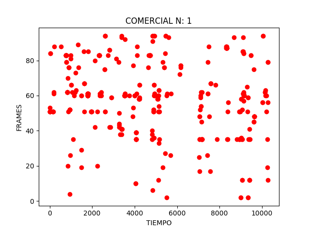

# Detector de comerciales
El objetivo de este proyecto es implementar un detector de avisos comerciales en televisión, esto significa encontrar
cada tiempo de inicio y termino de cada comercial en una transmisión de televisión. 
Para esto se cuenta con extractos de la programación emitida durante un día por un canal de televisión local, y una carpeta
que contiene los video comerciales que deben ser detectados.

# Como usar el detector?
Lo primero es que el código principal es el archivo "detector.py". Para usar dicho archivo se debe ingresar por línea de comandos:

$python detector.py 'directorio_comerciales' 'video de tv'

donde directorio_comerciales es la carpeta donde están contenidos los video comerciales y el video de TV es el video de TV que se desea analizar. 

En el archivo utils.py están contenidas la clase EHD_DESCRIPTOR la cual recibe un video (sea comercial o un programa emitido en TV) y computa el descriptor EHD para cada frame seleccionado y los guarda en un array. También está la clase K_NEIGHBORS que se encarga de encontrar los frames de los comerciales más parecido a un frame de TV.

En el archivo config.py se pueden modificar algunos parámetros del descriptor, de la detección, entre otros.

Cabe destacar que el código se demora aproximadamente 25 minutos en buscar 21 comerciales un video de TV de una hora.

# Librerias usadas
os 3.1(?)

sys 3.6.1

cv2 3.4.0

numpy 1.12.1

sklearn.linear_model 0.18.1

Para instalar python y todas las librerías anteriores se debe descargar la última versión de anaconda, y luego ejecutar el siguiente comando para tener la última versión de OpenCV:
$pip install opencv-contrib-python

# Como funciona?
Primero se calcula el descriptor EHD para cada frame seleccionado (en este caso se usan 3 frames por segundo), para cada video comercial y para el video de TV (esto se hace con la clase EHD_DESCRIPTOR). Luego, para cada descriptor del video de TV se debe encontrar cuales son los descriptores de entre todos los comerciales que más se parecen al descriptor de la TV (esto se hace con la clase K_NEIGHBORS). 
Con esto para cada frame de TV habra un candidato de comercial, es decir, para cada instante de tiempo habrá un video comercial y su respectivo frame como respuesta candidato. En el caso que solo se quiera detectar un solo video comercial y se graficara el frame candidato vs el tiempo se obtiene lo siguiente:

En dicha imagen podemos ver un conjunto especial de puntos que forman una recta (de pendiente aproximadamente 1). Dichos puntos es la aparición efectiva del comercial, en cambio los otros puntos son solo "ruido".
En el caso de que el comercial no se encuentre en la emisión de TV se observaría lo siguiente:

Es por esto, que el problema se reduce a encontrar un conjunto de puntos que forma una línea recta con pendiente 1 (aproximadamente).
